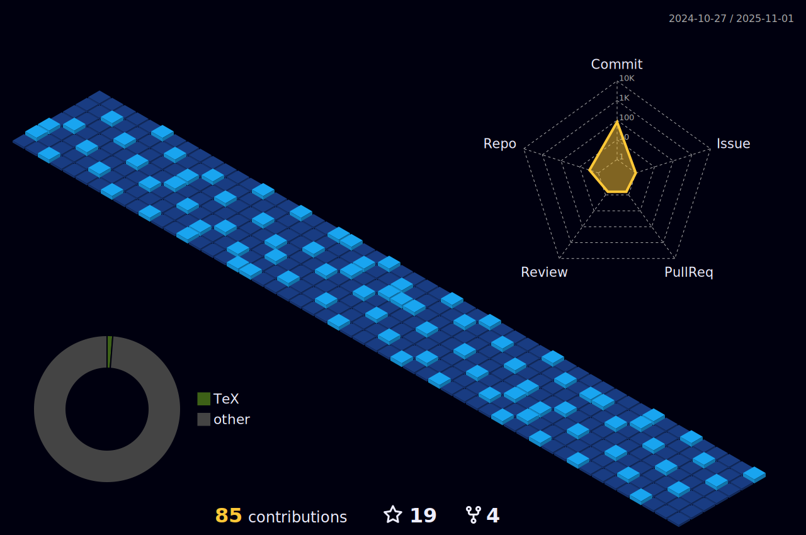

***
<!--

-->

I'm **Longhao Chen**, a student from China.

-   :heart: Computer, Electronics, Physics, Mathematics
-   :email: [Longhao.Chen@outlook.com](mailto:Longhao.Chen@outlook.com)
-   :hammer_and_pick: Julia, Javascript, C++, Github
-   :computer: GNU/Debian, Ubuntu, KDE Plasma, VSCode, Firefox
-   :key: GPG key: [`9045 CDDC 2CD2 86D6`](https://keys.openpgp.org/vks/v1/by-fingerprint/973E4323A871E6C9EC5B50AD9045CDDC2CD286D6)

***

